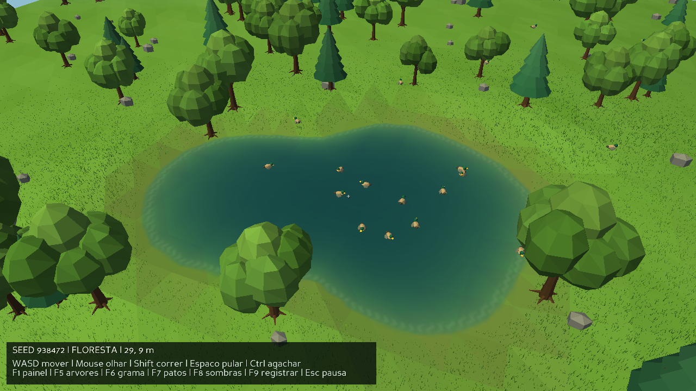

# Ducklands FPS

Jogo de exploração em primeira pessoa, com mundo procedural, vegetação densa e patos animados. Desenvolvido em Python com Panda3D e NumPy, com visual low-poly.



## O que há no jogo

- Terreno de 2 × 2 km com colinas, florestas e lagos de contorno irregular. A seed define a geração do mundo.
- Grama com vento, variações de cor e níveis de detalhe; árvores com galhos, raízes e copas variadas.
- Água com ondas, rastros de patos, perturbações ao caminhar e transição gradual para a margem.
- Patos que caminham, nadam, fogem e voam, além de bandos em formação no céu.
- Nuvens procedurais em duas camadas, iluminação, neblina e sombras configuráveis.
- Interface adaptável à resolução, métricas de desempenho, capturas e benchmarks.

A versão atual é a **0.5**. O foco é explorar o ambiente e observar os animais. Os modelos e as texturas são gerados pelo projeto.

## Instalação e execução

Requisitos: **Python 3.12 ou superior**, Windows e GPU com suporte a OpenGL/GLSL 1.30. As dependências são Panda3D 1.10.16 e NumPy 2.x.

Na pasta do projeto:

```powershell
.\run.cmd
```

O iniciador cria o ambiente `.venv` e instala as dependências ausentes. Na primeira execução, é necessário acesso à internet para a instalação. Também é possível abrir `run.cmd` por duplo clique.

Para instalar e executar manualmente:

```powershell
python -m venv .venv
.\.venv\Scripts\python.exe -m pip install -r requirements.txt
.\.venv\Scripts\python.exe -m game.main
```

Há uma alternativa em `run.ps1`, para ambientes que permitem scripts PowerShell. Se a execução desse script estiver bloqueada, use `run.cmd`.

## Controles

| Tecla | Ação |
| --- | --- |
| WASD / mouse | Mover / olhar |
| Shift | Correr |
| Espaço | Pular |
| Ctrl | Agachar |
| Esc | Pausar e liberar o cursor |
| Clique / Continuar | Retomar o jogo |
| F1 | Mostrar ou ocultar métricas |
| F5 | Adicionar cerca de 1.000 candidatos a árvores |
| F6 | Adicionar cerca de 10.000 candidatos a tufos de grama |
| F7 | Criar 50 patos no lago mais próximo |
| F8 | Alternar sombras: OFF, LOW, MEDIUM e HIGH |
| F9 | Salvar um registro de desempenho |
| F10 | Salvar uma captura de tela |

F5 e F6 distribuem o incremento pela região carregada e regeneram os chunks, incluindo a fauna. Parte dos candidatos é descartada junto aos lagos; o painel mostra os totais efetivos. O botão **Sair** fica no menu de pausa.

## Configurações

```powershell
.\run.cmd --seed 42 --resolution 1920x1080 --shadows low
.\run.cmd --resolution 800x450 --ui-scale 1.25
.\run.cmd --radius 1 --grass-density 12000
```

| Opção | Padrão | Descrição |
| --- | --- | --- |
| `--seed` | `938472` | Seed não negativa para gerar o mundo |
| `--resolution` | `1280x720` | Tamanho inicial da janela; mínimo de 320 × 240 |
| `--radius` | `2` | Raio de chunks carregados, de 1 a 5 |
| `--grass-density` | `40000` | Candidatos a tufos por chunk; aceita zero |
| `--ui-scale` | `1.0` | Escala dos textos, de 0.75 a 2 |
| `--shadows` | `off` | `off`, `low`, `medium` ou `high` |

Com raio 2, até 25 chunks de 64 × 64 m ficam carregados. A densidade padrão resulta em aproximadamente 900 mil tufos nessa região, dependendo do terreno. Reduzir o raio, a densidade ou a qualidade das sombras ajuda em máquinas com menos recursos.

A interface se reorganiza ao redimensionar a janela. Use ponto decimal nos argumentos, como `--ui-scale 1.25`. Os limites de cache, o orçamento de upload e os parâmetros de geração ficam em [`game/config.py`](game/config.py).

## Testes e desempenho

Executar os testes:

```powershell
.\.venv\Scripts\python.exe -m unittest discover -s tests -v
```

Executar uma verificação gráfica curta, sem janela interativa:

```powershell
.\run.cmd --offscreen --smoke --radius 1 --frames 120
.\run.cmd --offscreen --smoke --benchmark-route water --frames 300
```

O modo `--smoke` carrega a região inicial, percorre uma rota e encerra com `SMOKE_OK`. Com `--offscreen`, também salva uma captura. Use `--headless` para verificar a simulação sem renderização GPU; esse modo exige `--smoke` ou `--benchmark`.

Medir o desempenho após o carregamento inicial:

```powershell
.\run.cmd --benchmark 30 --benchmark-route streaming --shadows low
.\run.cmd --offscreen --benchmark 30 --benchmark-route water
```

As rotas disponíveis são `lake` (entorno do lago inicial), `water` (travessia da região do lago) e `streaming` (carregamento e retorno entre chunks). A duração de `--benchmark` é dada em segundos. A rota `water` também pode ser usada com `--smoke`.

Os registros são salvos em `benchmarks/history-v0.5.csv` e `benchmarks/latest.json`; as capturas ficam em `screenshots/`. O benchmark registra FPS, percentis de tempo de frame, picos e memória. F9 salva os frames recentes da sessão, incluindo carregamentos.

Para comparar resultados, mantenha seed, resolução, raio, densidade, sombras, rota e duração iguais. Resultados headless medem CPU; resultados offscreen podem diferir da execução em janela. As contagens de geometria incluem os níveis de detalhe ocultos, e a RAM registrada é a memória residente do processo.

## Estrutura do projeto

| Caminho | Responsabilidade |
| --- | --- |
| `game/main.py` | Inicialização, loop e argumentos |
| `game/engine/` | Geometria, iluminação, interface e colisões |
| `game/world/` | Terreno, streaming, vegetação, água e céu |
| `game/entities/` | Jogador, comportamento e animações dos patos |
| `game/systems/` | Consultas espaciais e benchmarks |
| `game/shaders/` | Shaders de grama, água e nuvens |

## Estado do desenvolvimento

A vegetação usa geometria agrupada, culling e níveis de detalhe. O streaming prepara buffers em workers e distribui os uploads entre frames. A água usa uma grade de superfície e limita a física aos lagos próximos.

Ainda há picos durante o carregamento de regiões densas. GPU instancing, persistência dos animais, áudio ambiente e reflexos de objetos na água estão entre as melhorias previstas. O material atual da água usa um reflexo aproximado do céu.

Documentação técnica:

- [Streaming e otimização](docs/optimization.md)
- [Vegetação e níveis de detalhe](docs/vegetation-v0.3.md)
- [Interface e densidade](docs/interface-v0.4.md)
- [Simulação de água e integração das margens](docs/water-v0.5.md)

A especificação inicial está em [`ducklands_fps_python_spec.md`](ducklands_fps_python_spec.md).
